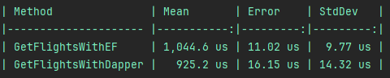
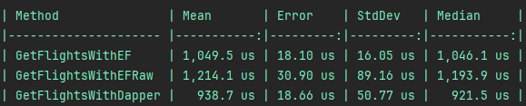
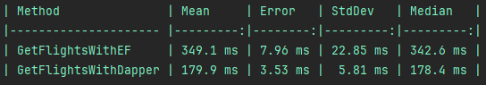

# Volgend project met Dapper?


*[Jochem Kalsbeek, oktober 2024](https://github.com/hanaim-devops/devops-blog-kriebslang/)*

<hr/>

Bij het bouwen van .NET applicaties spelen Object Relational Mappers (ORM’s) een grote rol voor het ophalen van data. Twee populaire opties zijn Dapper, 
een mico-ORM, en Entity Framework, een full-featured ORM. Beide ORM’s hebben hun eigen aanpak voor het ophalen van data. 

Entity Framework zorgt ervoor dat developers zich niet hoeven bezig te houden met het schrijven van complexe code.
Dapper daarentegen dwingt de developer hierbij om zelf zijn verantwoordelijkheid te nemen. (<a src="https://www.learndapper.com/dapper-vs-entity-framework">Learn Dapper</a>, 17 oktober 2024). In deze blogpost ga ik door middel van een hands-on karakter 
onderzoek doen naar hoe Dapper werkt en waarom jouw volgend project misschien wel Dapper moet gebruiken.

## Wat is Dapper?

Dapper is een open-source object-relational mapping (ORM) framework voor .NET. Deze library maakt het developers mogelijk om snel en gemakkelijk
data op te halen uit een database zonder het schrijven van complexe code (<a href="https://www.learndapper.com/">Learndapper</a>, 17 oktober 2024).
Dapper behoort tot de categorie van Micro ORM's, wat betekent dat het specifiek ontworpen is om queryresultaten snel te mappen naar objecten, 
maar zonder veel van de uitgebreide functionaliteiten die traditionele ORMs zoals Entity Framework bieden. 

Dit onderscheid wordt goed geïllustreerd in de bovenstaande tabel. Hierin zien we dat Dapper (als Micro ORM) voornamelijk 
focust op het eenvoudig mappen van queries naar objecten, terwijl uitgebreide features zoals change tracking, caching van resultaten, 
en ondersteuning voor lazy loading ontbreken. Deze eigenschappen worden daarentegen wel ondersteund door traditionele ORMs zoals Entity Framework.

## Waarom Dapper?

Dapper is geschreven door de bedenker van Stack Overflow, Sam Saffron. Zij hebben Dapper ontwikkeld om de performanceproblemen van Stack Overflow.
Stack Overflow werkte op Entity Framework waarbij bedacht was dat de LINQ2SQL queries snel genoeg zouden zijn. Maar wanneer
Google Stack Overflow ging indexen bleken er al snel performance problemen op te treden. 

"This process is usually pretty fast, however when its happening 100,000 times a day in huge bursts … it can get a bit costly." - <a href="https://samsaffron.com/archive/2011/03/30/How+I+learned+to+stop+worrying+and+write+my+own+ORM">Sam Saffron</a> (2011)

Dapper is ontwikkeld om deze problemen op te lossen. Waarbij de focus lag op performance en eenvoud. In de volgende hands-on tutorial gaan we testen wat de performance 
verschillen zijn tussen Dapper en Entity Framework op het gebied van query prestaties.


## Cheapest Flight Tickets
In deze hands-on tutorial richten we ons op het opzetten van een solution voor een fictieve applicatie genaamd ‘Cheapest Flight Tickets’ waarop gebruikers
fictief de goedkoopste vliegtickets kunnen bekijken.
Het doel van deze applicatie is om de performance van Dapper te vergelijken met die van Entity Framework in een benchmark.

De hoofdzaak van deze blogpost is het leren begrijpen van hoe data kan worden beheerd aan de hand van Dapper en hoe dit zich
verhoudt met Entity Framework op het gebied van gebruiksvriendelijkheid, performance en learnability. Daarbij beschouw
ik hoe Entity Framework precies werkt als bijzaak. Hierover worden in deze hands-on geen concrete voorbeelden gegeven.

### 1. Opzetten Applicatie 
Als eerste gaan we de applicatie opzetten. Deze solution bevat de volgende twee projecten:
- CheapestFlightTickets.Benchmark: Dit is een console project, hierin worden de benchmarks uitgevoerd om de performance te vergelijken. 
Dit project bevat de benchmark-logica en meet hoe snel Dapper en Entity Framework operaties kunnen uitvoeren.
- CheapestFlightTickets.Data: Dit project bevat de logica voor het beheren van de data, inclusief de database models voor zowel Dapper als Entity Framework. 
Dit project wordt gebruikt door het console project.

Maak beide projecten aan in de solution en installeer Dapper samen met Entity Framework in het data project. 
Om Dapper te installeren in het data project dien je alleen een package te installeren met het volgende commando:

```bash
    dotnet add CheapestFlightTickets.Data package Dapper
```

Als je dit commando hebt uitgevoerd is Dapper geïnstalleerd en is het klaar voor gebruik. 
De volgende stap is het installeren en configureren van Entity Framework zodat er een database kan worden gemaakt. Hoe dit moet laat ik in deze hands-on achterwege maar is <a href="https://github.com/hanaim-devops/devops-blog-kriebslang/tree/main/CheapestPlaneTickets">hier</a> terug te zien. 
De volgende stap is het schrijven van Dapper query’s.

### 2. Query's schrijven met Dapper
Gebruikers van Cheapest Flight Tickets willen graag een lijst van vluchten kunnen inzien met een prijs erbij. 
Hiervoor moet er een Dapper query worden geschreven die deze lijst met vluchten kan ophalen uit de database. 
Hieronder staat een voorbeeld van hoe een query kan worden opgesteld met Dapper:

```csharp
    public Flight? GetFlight(int id)
    {
        using var connection = new SqlConnection(_connectionString);
        connection.Open();
        var sql = $"""
                   
                           SELECT 
                               f.Id, 
                               f.DepartureTime, 
                               f.ArrivalTime, 
                               f.Price, 
                               f.PlaneId, 
                               p.Id, 
                               p.Model 
                           FROM Flights f
                           WHERE f.Id = @Id
                   """;

        return connection.Query<Flight>(sql,
                param: new { Id = id })
            .FirstOrDefault();
    }
```

Hierbij is duidelijk te zien dat Dapper eigenlijk niet veel meer is dan een verzameling extension methods op een 
SQLConnection die we kennen uit ADO.NET. Een van de verschillen met bijvoorbeeld Entity Framework is dat je bij Dapper 
zelf SQL moet schrijven terwijl bij Entity Framework dit voor jou geregeld wordt doordat je LINQ expressies kan gebruiken. 
Dapper biedt echter wel de mogelijkheid tot het gebruik van geparametriseerde query’s zoals je in het voorbeeld ziet.

#### Multimapping
Vorig voorbeeld mist nog iets. Model Flight kent namelijk een one-to-one-relation met Plane. Dapper laadt niet automatisch gerelateerde entiteiten. 
Gebruikers moeten zelf joins schrijven om data uit andere tabellen erbij op te halen. Dapper biedt echter wel de mogelijkheid om gerelateerde data te mappen. 
Als we de vorige query er weer bij pakken en we breiden deze verder uit met een join om het bijbehorende vliegtuig op te halen dan krijg je het volgende resultaat:

```csharp
    public Flight? GetFlight(int id)
    {
        using var connection = new SqlConnection(_connectionString);
        connection.Open();
        var sql = $"""
                   
                           SELECT 
                               f.Id, 
                               f.DepartureTime, 
                               f.ArrivalTime, 
                               f.Price, 
                               f.PlaneId, 
                               p.Id, 
                               p.Model 
                           FROM Flights f
                           INNER JOIN Planes p ON f.PlaneId = p.Id
                           WHERE f.Id = @Id
                   """;

        return connection.Query<Flight>(sql,
                param: new { Id = id })
            .FirstOrDefault();
    }
```

Nu haalt Dapper ook de bijbehorende data op. Echter zal hij deze nog niet goed mappen,
de volgende stap is om Dapper uit te leggen hoe wij de data graag gemapt willen hebben. Hieronder staat een voorbeeld hoe dit in zijn werking gaat.

```csharp
    public Flight? GetFlight(int id)
    {
        using var connection = new SqlConnection(_connectionString);
        connection.Open();
        var sql = $"""
                   
                           SELECT 
                               f.Id, 
                               f.DepartureTime, 
                               f.ArrivalTime, 
                               f.Price, 
                               f.PlaneId, 
                               p.Id, 
                               p.Model 
                           FROM Flights f
                           INNER JOIN Planes p ON f.PlaneId = p.Id
                           WHERE f.Id = @Id
                   """;

        return connection.Query<Flight, Plane, Flight>(sql, (flight, plane) =>
                {
                    flight.Plane = plane;
                    return flight;
                },
                splitOn: "PlaneId",
                param: new { Id = id })
            .FirstOrDefault();
    }
```

Door middel van een lambda-functie met daarin parameters ontvang je de gemapde data van zowel de data van de huidige 
entiteit als de gerelateerde entiteit. En geef je aan Dapper aan hoe hij gerelateerde data moet mappen. 
Door de splitOn property toe te voegen vertel je Dapper wanneer hij moet gaan beginnen met het mappen van de volgende entiteit gerelateerde entiteit.

### 3. Statements schrijven met Dapper
Naast het ophalen van vluchten moeten er ook vluchten kunnen worden toegevoegd.
Er moeten hiervoor ook statements worden geschreven met Dapper. Dit gaat eigenlijk op dezelfde manier als een query. 
Hieronder staat een voorbeeld van een insert statement met Dapper:

```csharp
    public void AddFlight(Flight flight)
    {
        using var connection = new SqlConnection(_connectionString);
        connection.Open();
        var sql = @"
        INSERT INTO Flights (Origin, Destination, DepartureTime, ArrivalTime, Price, PlaneId)
        VALUES (@Origin, @Destination, @DepartureTime, @ArrivalTime, @Price, @PlaneId)";

        connection.Execute(sql, flight);
    }
```

Hierbij komt weer de extension method terug die een geparametriseerde statement probeert uit te voeren over een SQLconnection. 
Het object dat vervolgens geïnjecteerd moet worden, geef je via een parameter mee aan deze methode.

### 4. Installeren benchmark tool

Om de performance te vergelijken tussen entity framework en Dapper maken we gebruik van benchmark dotnet. 
We moeten benchmark dotnet installeren via nuget. (<a src="https://benchmarkdotnet.org/articles/overview.html">BenchmarkDotNet</a> z.d) 
Open de terminal in het benchmark project en voor het volgende commando uit:

```bash
    dotnet add package BenchmarkDotNet
```

Hierna staat benchmark dotnet geïnstalleerd en hoeft deze alleen geconfigureerd te worden. Waarna de benchmark geschreven kan worden. 
Hoe dit moet laat ik in deze tutorial achterwege maar het uiteindelijke resultaat vind je <a href="https://github.com/hanaim-devops/devops-blog-kriebslang/tree/main/CheapestPlaneTickets">hier</a> terug.

### 5. Benchmarking

De benchmark die geschreven is in de vorige stap, gaan we nu uitvoeren zodat we kunnen vergelijken hoe Dapper presteert ten 
opzichte van Entity Framework op het gebied van query prestaties. De benchmark kun je uitvoeren door het volgende commando 
in de terminal van het benchmark project te typen:

```bash
    dotnet run --configuration Release
```

Dit commando zal de benchmark starten. Als ik de benchmark uitvoer krijg ik onderstaande resultaten terug. 
Hierin is duidelijk te zien dat de query van Dapper een kortere uitvoeringstijd heeft dan de query van Entity Framework. Dit heeft te maken met het feit dat Entity Framework 
eerst een LINQ query moet vertalen naar SQL voordat hij deze kan uitvoeren op de database.



Er is ook functionaliteit binnen Entity Framework waarmee
query’s kunnen worden opgebouwd met SQL (<a href="https://learn.microsoft.com/en-us/ef/core/querying/sql-queries?tabs=sqlserver">Microsoft</a> z.d) . Hieronder staat nog een benchmark waarbij ook deze functionaliteit gebruikt wordt in de benchmark:



Dit geeft niet het resultaat waar we gehoopt op hadden. Microsoft beschrijft in [dit artikel](https://learn.microsoft.com/en-us/ef/core/querying/sql-queries?tabs=sqlserver">dat deze functionaliteit voor een andere intentie ontwikkeld is. Het moet namelijk gebruikt worden om SQL te combineren met LINQ. 

Nu zal hij tweemaal de compilestap doorlopen. Eenmaal om de SQL om te zetten naar LINQ en nogmaals om LINQ weer om te zetten naar SQL die hij uitvoert op de database. Dit verklaart de langere uitvoeringsduur. Ook Software Developer Salih Cantekin (2022) deed een [benchmark](https://salihcantekin.medium.com/the-big-fight-dapper-vs-entity-framework-detailed-benchmark-2345af933382) waarbij hij tot dezelfde conclusie kwam.

#### Grotere dataset
Het vorige voorbeeld is uitgevoerd op een kleine dataset lees ongeveer honderd records. Wat gebeurt er als we de dataset 
vergroten naar ongeveer honderdduizend records? Is het resultaat dan hetzelfde? Dit heb ik uitgevoerd met het onderstaande resultaat:



Hierbij valt op dat het verschil tussen Dapper en Entity Framework groter wordt naarmate de dataset groeit. 
Bij de kleinere dataset was het gemiddelde verschil tussen Dapper en Entity Framework kleiner dan bij de grote.

## Conclusie
Beide ORM’s bieden eigen voordelen voor het gebruik van de een boven de ander. Entity Framework zorgt ervoor dat developers 
zich bijna geen zorgen hoeven te maken over het schrijven van SQL query’s. Echter blijkt uit dit onderzoek dat Entity Framework minder 
goed scoort op het gebied van query prestaties. Bij grotere datasets wordt het prestatieverschil tussen Dapper en Entity Framework alleen maar groter. 
Daarom is de keuze tussen beide frameworks afhankelijk van de specifieke projectvereisten: kies Dapper voor optimale prestaties en controle, 
en Entity Framework voor eenvoud en productiviteit.

## Bronnen

- Mahajan, H. (2024, 9 oktober). *Dapper vs EF Core: Which ORM framework should you choose for your .NET application?* Level Up Coding. Geraadpleegd van [https://levelup.gitconnected.com/dapper-vs-ef-core-which-orm-framework-should-you-choose-for-your-net-application-54f2723b176a](https://levelup.gitconnected.com/dapper-vs-ef-core-which-orm-framework-should-you-choose-for-your-net-application-54f2723b176a)
- ZZZ Projects (17-10-2024). *Dapper vs Entity Framework*. Learndapper.com. Geraadpleegd op 9 oktober 2024 van [https://www.learndapper.com/dapper-vs-entity-framework](https://www.learndapper.com/dapper-vs-entity-framework)
- Cantekin, S. (z.d.). *The big fight: Dapper vs Entity Framework detailed benchmark*. Medium. Geraadpleegd op 9 oktober 2024 van [https://salihcantekin.medium.com/the-big-fight-dapper-vs-entity-framework-detailed-benchmark-2345af933382](https://salihcantekin.medium.com/the-big-fight-dapper-vs-entity-framework-detailed-benchmark-2345af933382)
- Patel et al. (2023, 24 aug). *SQL queries*. Learn Microsoft. Geraadpleegd op 9 oktober 2024 van [https://learn.microsoft.com/en-us/ef/core/querying/sql-queries?tabs=sqlserver](https://learn.microsoft.com/en-us/ef/core/querying/sql-queries?tabs=sqlserver)
- Saffron, S. (2011, 30 maart). *How I learned to stop worrying and write my own ORM*. Sam Saffron. Geraadpleegd op 9 oktober 2024 van [https://samsaffron.com/archive/2011/03/30/How+I+learned+to+stop+worrying+and+write+my+own+ORM](https://samsaffron.com/archive/2011/03/30/How+I+learned+to+stop+worrying+and+write+my+own+ORM)


